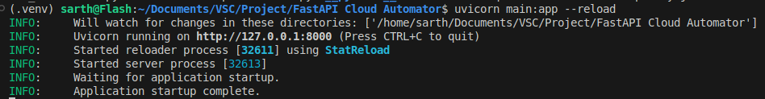

# AWS Cloud Automation using Boto3 and FastAPI
### This project automates the lifecycle of an EC2 instance on AWS using a FastAPI backend. It allows users to launch a compute instance, execute shell commands remotely, retrieve the output, and then terminate the instance—all via a single API endpoint
## Getting Started
- We use the AWS SDK for Python (Boto3) to create, configure, and manage AWS services.

- We will wrap everything in a FastAPI backend and run the automation using the API calls.

> NOTE -  Boto3 requires a version of Python 3.9 or later 

### Step 1: Install the Requirements
All the requirements (Boto3, FastAPI and uvicorn) are mentioned in the [requirements.txt](./requirements.txt) file and can be easily installed with few steps- 
  - First setup a virtual environment
    ```sh
    python -m venv .venv
    source .venv/bin/activate
    ```
  - Install the requirements
    ```sh
    pip install -r requirements.txt
    ```
---
### Step 2: Configure the AWS on command line
Before using Boto3, we need to set up authentication credentials for the AWS account 

#### 2.1 Installing the AWS CLI (for Linux) 
   - Download the installer 
     ```sh
     curl "https://awscli.amazonaws.com/awscli-exe-linux-x86_64.zip" -o "awscliv2.zip"
     ```
   - Unzip the installer 
     ```sh
     unzip awscliv2.zip
     ```
   - Run the install script
     ```sh
     sudo ./aws/install
     ```
   - Verify Installation
     ```sh
     aws --version
     ```
#### 2.2 Configure the CLI 
```sh
aws configure
``` 

You'll be prompted to enter: 
- AWS Access Key ID
- AWS Secret Access Key
- Default region name (e.g., us-east-1)
- Output format (e.g., json)

## The Boto3 and FastAPI script
- We are using FastAPI because FastAPI is a modern, fast (high-performance), web framework for building APIs with Python.

- The [main.py](./main.py) file contains the API calls to the FastAPI server. These API calls will use function calls in order to handle the lifecycle of the instance.

- The [ec2_automation.py](./ec2_automation.py) script contains the Boto3 code for automation of the instance lifecycle.

    1. **Function `launch_instance`**
        - Launches a new EC2 instance using predefined configuration (AMI ID, instance type, key, security group, etc.).

        - Attaches an IAM role (MyEC2SSMInstanceProfile) to enable SSM command execution.

        - Waits until the instance is fully running and reloads its metadata.

        - Returns the instance ID and public DNS name.

    ---

    2. **Function `get_output`**
        - Sends a shell script to the specified EC2 instance using AWS Systems Manager (SSM).

        - The script logs a message, waits for 10 seconds, and logs another message.

        - Periodically polls the SSM command status until it finishes.

        - Returns:

            - The standard output of the command.

            - Any error output.

            - Final status of the command (e.g., Success, Failed).
        
        ***What is SSM?***

        ***SSM (AWS Systems Manager) is a service that lets you remotely manage and run commands on EC2 instances without needing SSH.
        We're using it to execute shell scripts on the instance and fetch the output programmatically.***

        #### Thus we need to create an IAM role with a trust policy that allows EC2 to assume the SSM role. The json file for the trust policy is mentioned in [trust-policy.json](./trust-policy.json).

        #### Step 1: Create the IAM Role
        ```sh
        aws iam create-role \
        --role-name EC2SSMRole \
        --assume-role-policy-document file://trust-policy.json
        ```
        #### Step 2: Attach Permissions
        ```sh
        aws iam attach-role-policy \
        --role-name EC2SSMRole \
        --policy-arn arn:aws:iam::aws:policy/AmazonSSMManagedInstanceCore
        ```
        #### Step 3: Create Instance Profile
        ```sh
        aws iam create-instance-profile --instance-profile-name MyEC2SSMInstanceProfile

        aws iam add-role-to-instance-profile --instance-profile-name MyEC2SSMInstanceProfile --role-name EC2SSMRole

        ```

    ---
    3. **Function `terminate_instance`**
        - Terminates the EC2 instance with the given instance ID.

        - Waits until the instance is completely terminated.

        - Prints a confirmation message once the termination is successful.
---
## Executing the script
**In order to execute the [main.py](./main.py) file locally, we use `uvicorn`**
```sh
uvicorn main:app --reload
```


**Upon entering the URL to postman we can see-**


**Upon entering the endpoint that runs the instance lifecycle(/run-script)-**


### Thus we can see that- 
- An instance was created with the given instance id. 
- A shell script provided through SSM was executed. 
- The instance was terminated.


### This can also be verified through AWS Console- 
